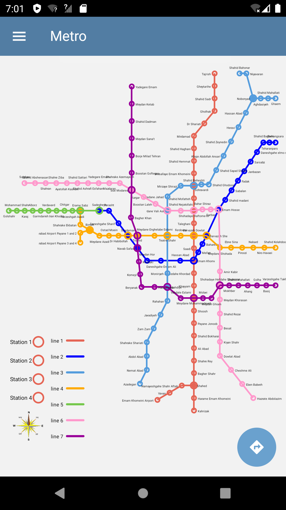
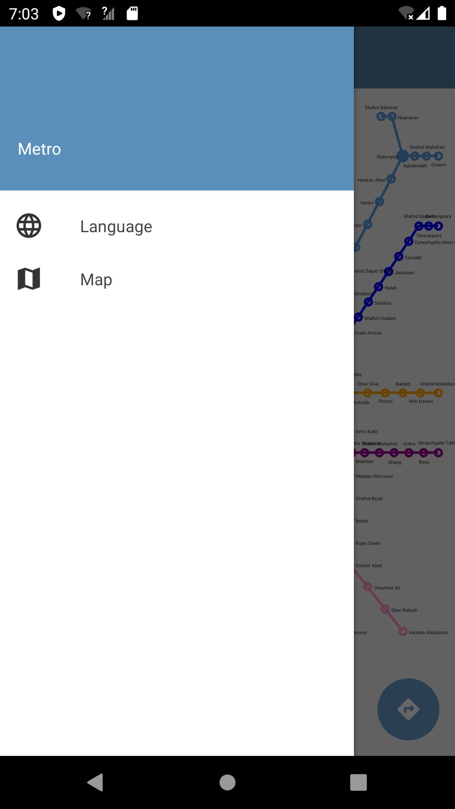
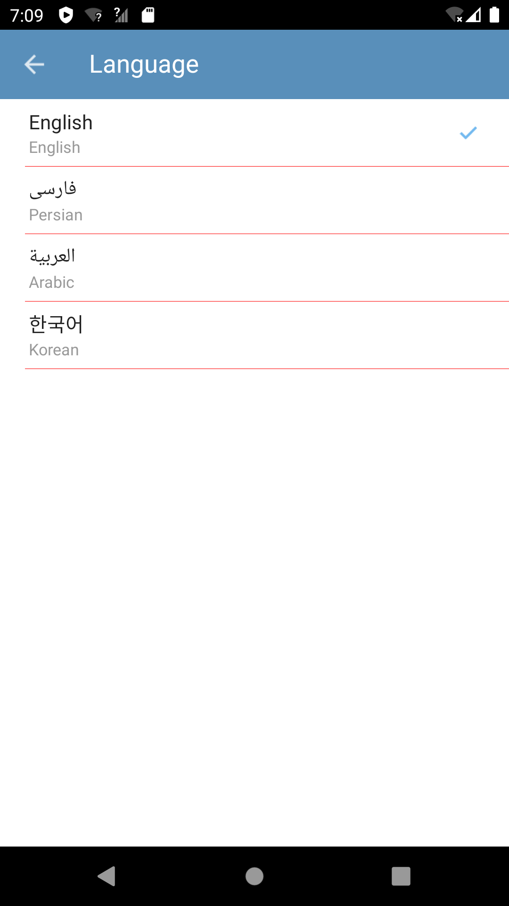
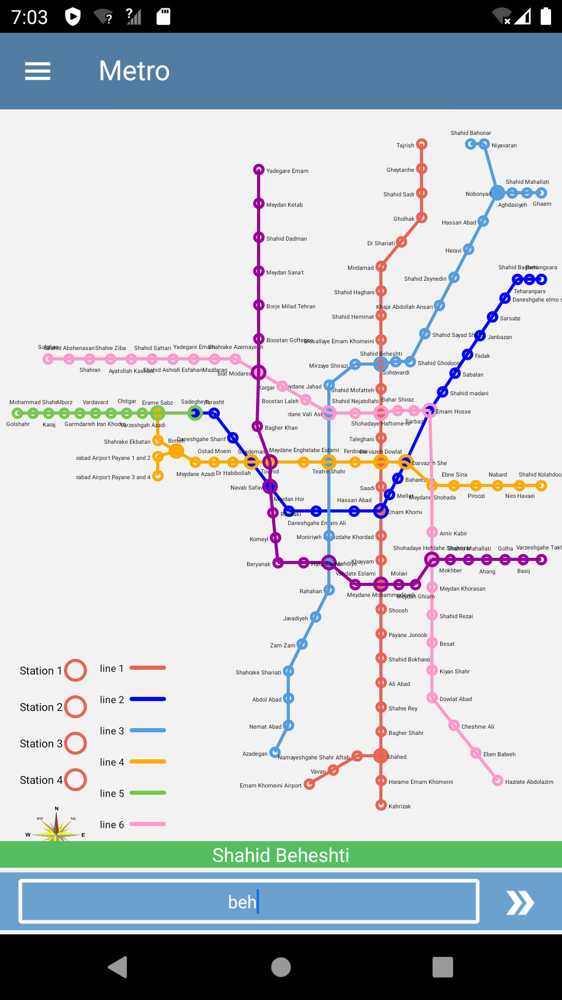
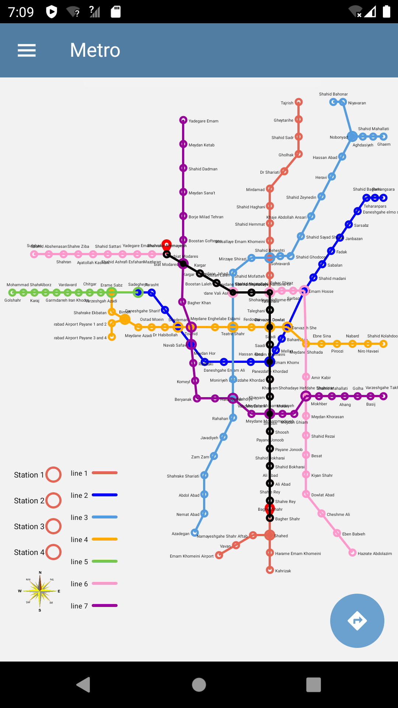
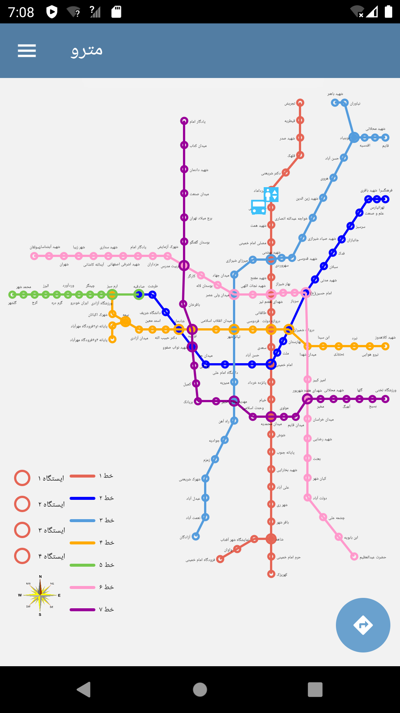

# Tehran Metro
Tehran metro interactive android app

## Table of content

* [Introduction](#Introduction)
 
* [Screenshots](#Screenshots)

* [App Gif](#App-Gif)

* [To Do](#To-Do)

## Introduction
All metro applications that I have seen used images to show the metro's map. In this app, I tried to draw the metro map with android canvas.
So it is easy to interact with the map. We can click the station to see their facilities, find the shortest path between two stations, and do other things with this app.

## Screenshot
<table  style="border: 1px solid black; width: 100%; word-wrap:break-word;
              table-layout: fixed; text-align:center" >
 <tr>
    <td align="center" valign="center">Map fragment</td>
     <td align="center" valign="center">App drawer layout</td>
     <td align="center" valign="center"> Language fragment</td>
  </tr>
  <tr>
    <td align="center" valign="center"></td>
    <td align="center" valign="center"></td>
    <td align="center" valign="center"></td>
  </tr>
  <tr>
    <td align="center" valign="center">Routing</td>
     <td align="center" valign="center">Shortest Path</td>
     <td align="center" valign="center">Station facilities</td>
  </tr>
  <tr>
    <td align="center" valign="center"></td>
    <td align="center" valign="center"></td>
    <td align="center" valign="center"></td>
  </tr>
 </table>

 ## App Gif

## To Do
 * Add other cities metro and BRT 
